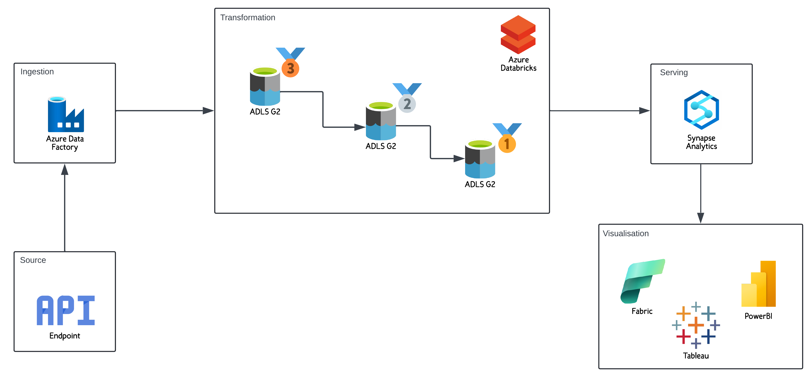

# E2E-Earthquake-Data-Eng-Project

# Project Overview

Earthquake data is incredibly valuable for understanding seismic events and mitigating risks. Government agencies, research institutions, and insurance companies rely on up-to-date information to plan emergency responses and assess risks. With this automated pipeline, we ensure these stakeholders get the latest data in a way that’s easy to understand and ready to use, saving time and improving decision-making.

This guide walks you through creating a scalable data pipeline in Azure, transforming raw data into meaningful insights using Databricks, Azure Data Factory (ADF), and Synapse Analytics.

## What is done
1. Configure Azure Databricks and securely access data in Azure Storage.
2. Process and transform data using Databricks notebooks (bronze, silver, gold).
3. Automate data pipelines with Azure Data Factory.
4. Query and optimize data in Synapse Analytics for analytics and visualization.

## Prerequisites
Azure account (free trial available)
Basic understanding of data engineering concepts

## Technologies Used
* Azure Databricks
* Azure Data Factory
* Azure Synapse Analytics